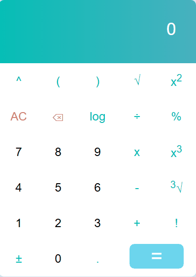

# React Calculator

A user friendly and responsive calculator application built using React. It supports basic arithmetic operations like addition, subtraction, multiplication, and division. Perfect for learning and practicing React concepts such as components, state, and event handling.

## Live Demo
[Click here to try the calculator!](https://arbabzaheer.github.io/react-calculator)

## Preview


## Features
- Addition, subtraction, multiplication, and division
- Responsive design
- Clear button to reset the calculator


## Cloning and Running the Application in local

Clone the project into local

Install all the npm packages. Go into the project folder and type the following command to install all npm packages

```bash
npm install
```

In order to run the application Type the following command

```bash
npm start
```

The Application Runs on **localhost:3000**
